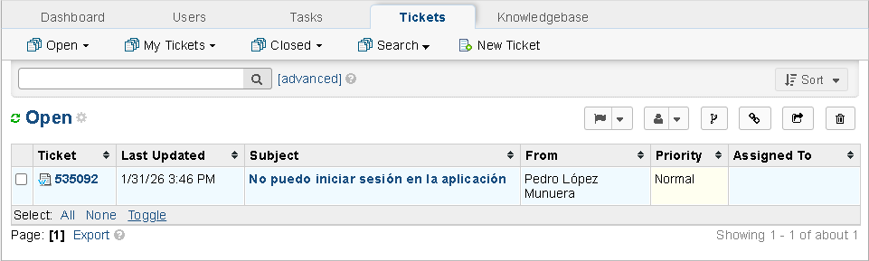
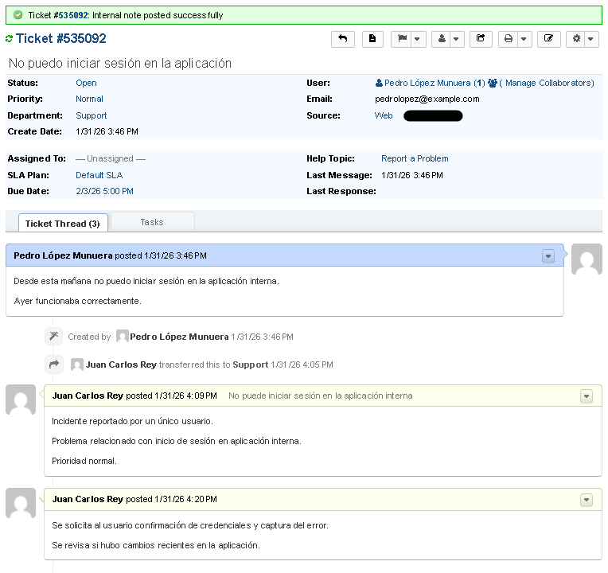
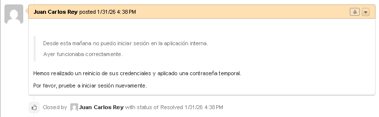
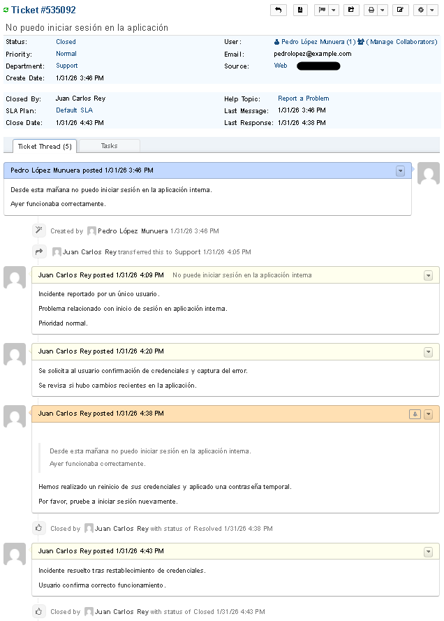

# Lab 1 - Usuario no puede iniciar sesión

## Objetivo
Simular la gestión completa de un ticket de Help Desk usando osTicket.

## Entorno
- Sistema de ticketing: osTicket
- Rol: Help Desk Nivel 1
- Servidor: Ubuntu Server 22.04 LTS (VirtualBox)
- Cliente: Windows 11

## Incidente
Usuario reporta que no puede iniciar sesión en la aplicación interna.

## Gestión de ticket
- Clasificación: Prioridad normal
- Investigación: revisión de credenciales y cambios recientes

## Resolución
Realizamos un reinicio de credenciales y aplicamos una contraseña temporal.

## Resultado
El usuario confirma que puede acceder correctamente.
Ticket cerrado y documentado.

## Conclusiones
En este lab se ha recreado el flujo completo de un ticket usando osTicket.
Se ha practicado los pasos de clasificación, asignación a agentes, resolución y documentación de los incidentes.
